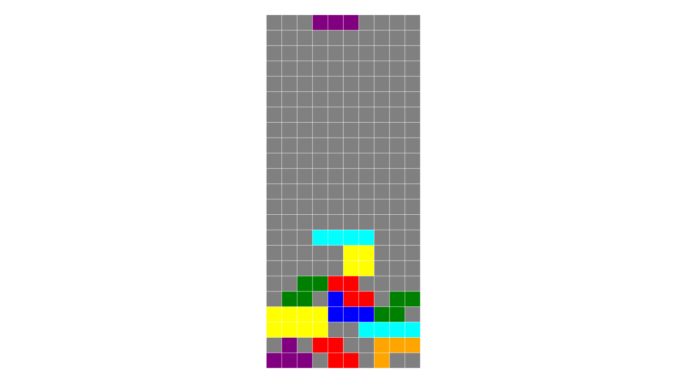

# Tertis
Tertis is a simple tetris clone.

## Game Status
The game is still in the early development.  
Only the main game features are implemented(piece movement, lines cleaner, game over checker).  
The rest of the game such as points display, game over menu,main menu, keyboard setter, play again, etc are not yet implemented.

## The Game

<!---
)
-->

## Installation

The project can be imported and used by any ide that supports CMake.  
It works both on Windows and Linux(only Ubuntu was tested)

## Contributing
Pull requests are welcome. For major changes, please open an issue first to discuss what you would like to change.

## License
[GPLv3](https://choosealicense.com/licenses/gpl-3.0)
